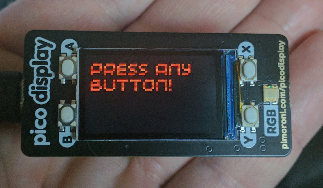
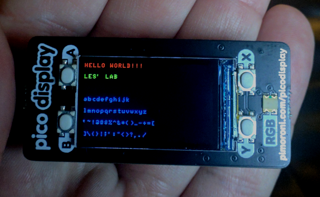
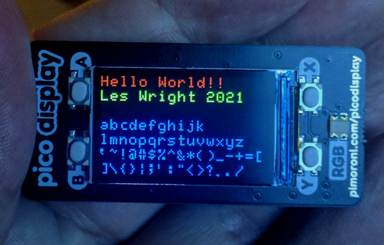

# picofont
Fonts for the Raspberry Pico Display

**What is it?**

This is a new Font for the Raspberry Pi Pico Display from Pimoroni: https://shop.pimoroni.com/products/pico-display-pack

This program and associated information is Open Source (see Licence), but if you have gotten value from these kinds of projects and think they are worth something, please consider donating, even a dollar: https://paypal.me/leslaboratory?locale.x=en_GB

The built in font (compiled into the firmware) is not particularly pretty:

I wanted something a little more readable and pleasing to the eye for an upcoming project.
The code is a pure Python implementation, using a look up table for the chracter data, just like the good ol' days of assembly programming!

Above:An image of the size 1 font

Above:An image of the size 2 font
