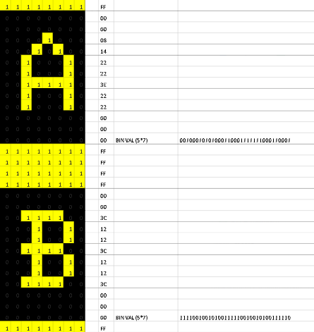

# picofont
Fonts for the Raspberry Pico Display

**Update V1.1 Released for faster update! Scroll to the end!**

**What is it?**

This is a new Font for the Raspberry Pi Pico Display from Pimoroni: https://shop.pimoroni.com/products/pico-display-pack

This little display is way cool, but the font built into the firmware is not the best (see first image below).
I wanted something a little more readable and pleasing to the eye for an upcoming project.

Above: The built in font (compiled into the firmware) is not particularly pretty:

The code is a pure Python implementation, using a look up table for the chracter data, just like the good ol' days of assembly programming!

In src, is an easy to use Python implementation of a 5x7 ASCII font and associated helper functions (scroll to the bottom for usage or watch the video here: https://youtu.be/BMlGyAYNdF8)
bin-2-hex.xlsm is a handy spreadsheet I made for designing Characters (For vintage computer projects). This is useful if you want to design your own fonts, just click the cells to toggle the pixels, and it spits out binary and hex data :-) Check it out!

This program and associated information is Open Source (see Licence), but if this solved a problem and you think it is worth something, please consider donating, even a dollar: https://paypal.me/leslaboratory?locale.x=en_GB

**How to use it**

Dead simple (see the code example)

But if you are not sure:
Set the pen color: e.g    display.set_pen(255,0,0)

**printstring (printstring takes 4 parameters: String, X, Y, Size(1 (pico sized) or 2 (micro sized)))**

e.g  printstring("Hello World!",0,0,2)

**printchar (As above 4 parameters, char, X, Y, Size)**

princhar displays a single character (useful if you want to change a single value on screen)

e.g  printchar("A",0,0,2)

Above:An image of the size 1 font

Above:An image of the size 2 font

**delchar (takes 3 parameters, X, Y and size)**
delchar(0,0,2)
**note to overwrite a character, you must first delete it!**

**Code questions**

I'm sure if you know how to code you will have questions!

A video will be released on my youTube channel shortly, but for thos who can't wait...

**Why are some characters data longer than others in cmap?**

I tried to be lean with data. Most fonts are 5x7, however some chars have descenders (or tails?), for example lower case 'q' (see the spreadsheet)

**Why did you not use a nested list of say binary data?**

Either Thonny or Micropython kept throwing a fit when I tried this initially so a list of strings it is!

**What if I want to use my own characters?**

Take a look at: bin-2-hex.xlsm 
This is a handy spreadsheet I made for designing Characters (For vintage computer projects).
Just click the cells to toggle the pixels, and it spits out binary and hex data :-) Check it out!

V 1.1

Refactored for speed suggested by Steve Borg:
https://forums.pimoroni.com/t/pico-display-and-fonts/16194/18

"Refactor it slightly so that the various functions take an optional parameter to tell it
whether to do a display.update() you can get it so it draws much more quickly.
That way those that like the teleprompter type output can leave it to update after each character
and those that don’t could update after each string."

printchar naw has the extra parameter: charupdate (Boolean (True/False)
printchar(letter,xpos,ypos,size,charupdate)
delchar has the same
delchar(xpos,ypos,size,delupdate)
These sell the functions whether or not to do a display.update() on every char (slow)

Printstring has two extra args charupdate and strupdate (Boolean (True/False)
printstring(string,xpos,ypos,size,charupdate,strupdate) 

These say whether to call display.update() on individual chars (slow) or on the entire string (fast)
You can set them both to false if you want, send multiple lines, then do a display.upadte() manually if you like
(see example code below)

Have fun!

Les

